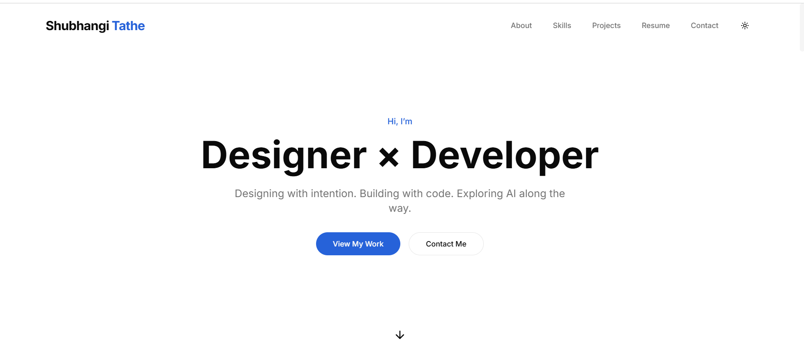

# ✨ Shubhangi's Portfolio

> A minimal, modern, and performance-focused developer portfolio built with **Next.js** and **Tailwind CSS**.

---

<div align="center">
  
</div>

<div align="center">
  <p><em>A clean and responsive portfolio showcasing my work, skills, and projects.</em></p>

  <h3>
    <a href="https://your-vercel-link.vercel.app/" target="_blank">🌐 View Live Demo</a>
  </h3>

</div>

---

# 💻 About This Project

This portfolio represents my journey as a developer.

It was designed with a focus on:

- Clean UI
- Fast performance
- Responsive layout
- Simple navigation
- Recruiter-friendly presentation

The goal was to create a **minimal but impactful developer presence online**.

---

# 🌸 Tech Stack

This project is built using modern web technologies:

- ⚛️ **Next.js**
- 🟢 **Node.js**
- 🎨 **Tailwind CSS**
- 🧩 **HTML5**
- ⚡ **JavaScript (ES6+)**

---

# 🚀 Live Project

🌐 **Live Website**

https://your-vercel-link.vercel.app/

🎥 **Demo Video**

Add your recorded demo video link here.

---

# 🖼 Preview

You can also add a GIF demo of the portfolio here.

```

```

---

# 💡 Highlights

- Minimal aesthetic UI
- Mobile-first responsive design
- Reusable component architecture
- Performance-focused structure
- Recruiter-friendly layout
- Scalable codebase

---

# 🧠 What I Learned While Building This

Building this portfolio helped me improve in:

- Real-world **Next.js project structure**
- Component-based development
- UI spacing and design balance
- GitHub documentation practices
- Deployment workflows
- Building clean developer portfolios

---

# 📂 Project Structure

```
Shubhangi-Portfolio/
├── app/                  # Next.js app directory (routing, pages)
├── components/
│   ├── layout/           # Layout components (Navbar, Footer)
│   ├── sections/         # Page sections (Hero, About, Projects)
│   └── ui/               # Reusable UI components
├── data/                 # Static data (projects, skills)
├── lib/                  # Utility functions
├── providers/            # Context providers
└── public/               # Static assets (images, icons)
```

---

# 🚀 Getting Started

If you want to run this project on your local machine:

---

## 1️⃣ Clone the repository

```bash
git clone https://github.com/your-username/your-repository.git
```

---

## 2️⃣ Navigate to the project folder

```bash
cd your-repository
```

---

## 3️⃣ Install dependencies

```bash
npm install
```

or

```bash
yarn install
```

---

## 4️⃣ Start the development server

```bash
npm run dev
```

or

```bash
yarn dev
```

After starting the server, open:

```
http://localhost:3000
```

---

# ⚙️ Available Scripts

```bash
npm run dev      # Run development server
npm run build    # Create production build
npm start        # Run production server
npm run lint     # Run code linting
```

---

# 🔮 Future Improvements

Planned upgrades for this portfolio:

- Dark / Light mode toggle
- Smooth UI animations
- Blog section
- SEO improvements
- Performance analytics
- Additional projects showcase

---

# 📬 Connect With Me

- GitHub: https://github.com/your-username
- LinkedIn: https://linkedin.com/in/your-profile
- Email: your-email@example.com

---

# 🤍 Why This Portfolio Matters

This portfolio is more than just a website.

It reflects:

- My design thinking
- My development skills
- My attention to detail
- My growth as a developer

---

# ⭐ Support

If you like this project, consider giving it a **star on GitHub**.

It really helps and motivates me to build more.

---

# 🙏 Thank You

Thank you for taking the time to explore my portfolio project.

I appreciate your interest in my work.

Have a great day!
